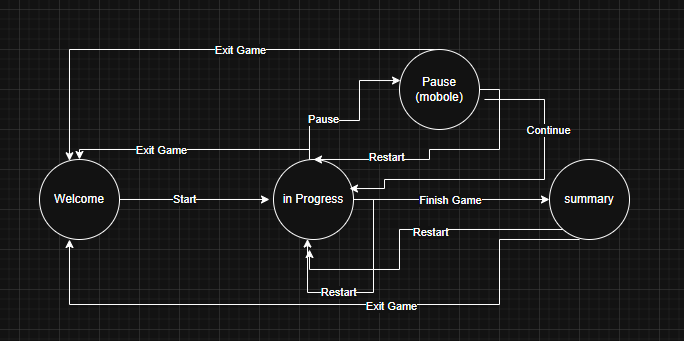

# Memory Game

## Project Description

### Try Game:


https://frontend-mentor-memory-game.vercel.app/

## Description

A fun and engaging online memory game where players flip cards to find matching pairs. 
Test and improve your concentration, attention, and short-term memory as you try to match all pairs 
in the fewest moves or fastest time. Suitable for all ages and playable on any device.

### State machine



### View

Welcome


Game - grid 4x4, number, 1 player


Game - grid 6x6, icon, 3 players


Result


Pause (only mobile version)


#### Gameplay Overview

- Play the Memory game either solo or multiplayer (up to 4 players)
- Set the theme to use numbers or icons within the tiles
- Choose to play on either a 6x6 or 4x4 grid
- View the optimal layout for the game depending on their device's screen size
- See hover states for all interactive elements on the page

## Development

How to install project:

```
git clone https://github.com/aga-siwek/frontend-mentor-memory-game
cd hangman-game
npm install
npm run dev
```
